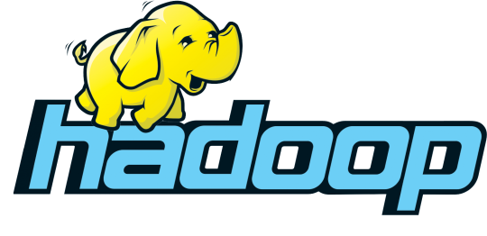
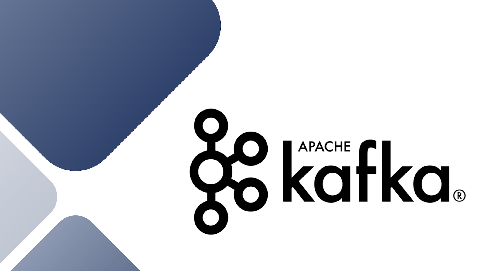
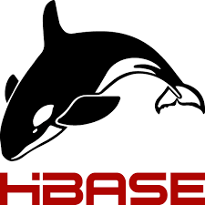

## Hi I'm Lin Lin 

🚀 Check out my Portfolio: [linlinhlaing.com](https://linlinhlaing.com/)

---

Hello!  
I am Lin Lin Hlaing, a **Machine Learning Engineer** with 3 years of experience in creating and deploying models using **TensorFlow** and **Keras**. My background includes developing object detection and image processing solutions.

### 📫 Reach Me Out!

    
    
    
    

---

### 🌟 What I Currently Do
- 🎓 Pursuing a **Master's in Computer Science** at Maharishi International University via distance education.
- 🤖 Developing projects in **image processing** and **NLP** to expand my skills.
- 📫 How to reach me: [Lin Lin Hlaing](https://www.linkedin.com/in/lin-hlaing/).
- 😄 Pronouns: **Lin Lin**.
- ⚡ Fun fact: I enjoy **drawing** and **photography**.

---

### 💻 Top Technologies

| Python | NumPy | Pandas | Django | Flask | Hadoop | Java |
|--------|-------|--------|--------|-------|--------|------|
|  |  |  |  |  |  |  |

| AWS | Google Cloud | NLP | Kafka | Hive | HBase | OpenCV |
|-----|--------------|-----|-------|------|-------|--------|
|  |  |  |  |  |  |  |

---

### 📄 Professional Links
- **Resume**: [My Resume/CV](https:/
